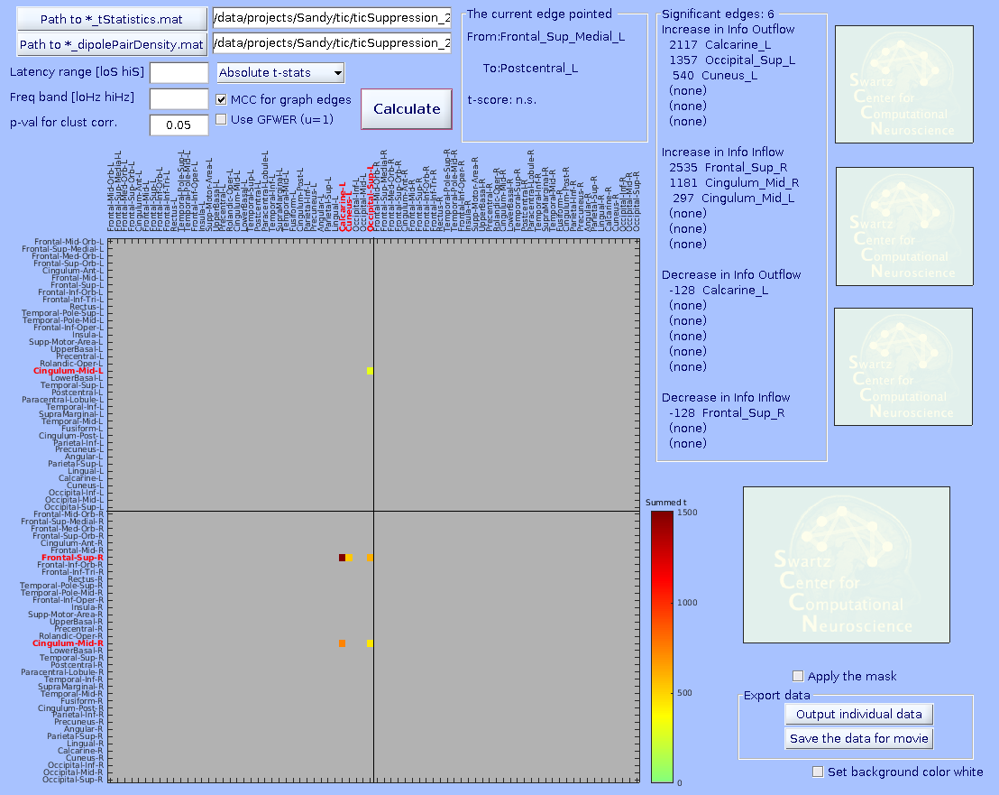
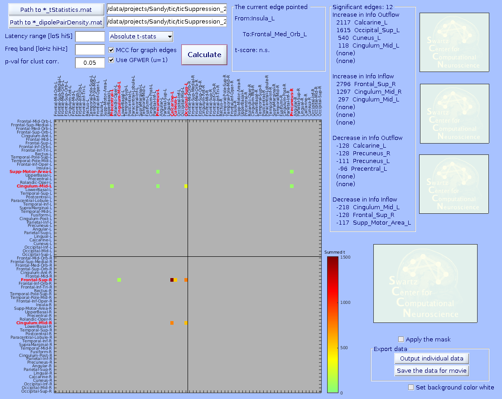
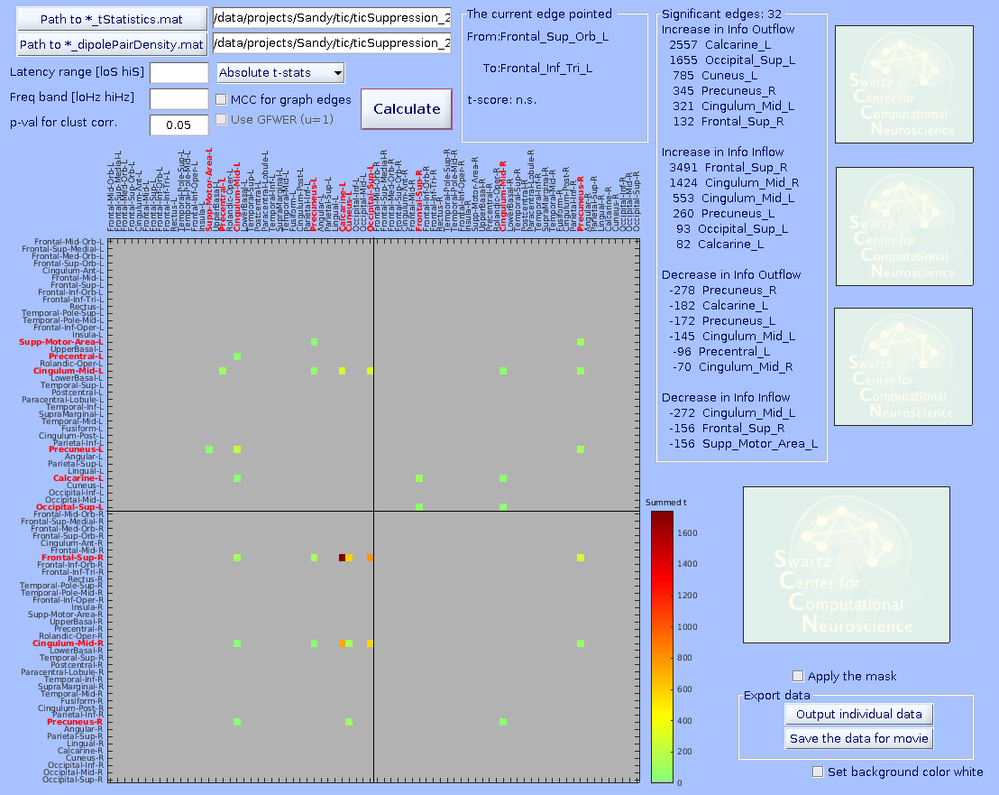

[](http://www.youtube.com/watch?v=jHngHEIsg7Q)

Click to play the movie on Youtube. This movie shows the first application of *groupSIFT* in Loo et al. (2019) *NeuroImage: Clinical*

This page is for those who wants to cooperate with me to test groupSIFT
toolbox. Unfortunately, at this point I cannot provide much user
support. I know this page does not cover full detail either (including
how to determine SIFT parameters). So this plugin is for advanced user
who have good experience with Matlab and SIFT. When you use it, please
do so at your own risk!

If you are interested in learning basic SIFT functions using its own built-in simulator, see [this
    page](https://sccn.ucsd.edu/wiki/How_to_run_SIFT_simulation#2._Set_parameters)

Environment
===========

-   I originally developed it with Matlab R2013a runninig on Fedora 22
    (64bit) with dual monitors with 1600 x 1200 resolution. In a recent
    project, I updated it for Matlab 2017b, EEGLAB 14.1.2, and SIFT 1.52
    (with customized movie function). I have not fully investigated
    dependency on different environments other than Linux. Matlab Image
    Processing Toolbox is necessary to use bwlabel().

Required preprocessing (08/15/2020 updated)
===========================================

-   You need EEGLAB .set files that are processed with ICA and
    subsequent IC selection: ALL the ICs in your data will go to SIFT
    preprocess. You don't want to use 100 ICs that will create 100 x 100
    x frequency x time tensor for n subjects in the end! There is also
    datapont-to-parameter ratio you want to consider. Also, DIPFIT must
    be done. Use ICLabel() plugin to select ICs with 'brain' label
    probability \> 0.7, for example.
-   Downsample the data to nearly 100-120 Hz using the additional two
    options in this way: pop_resample(EEG, 100, 0.8, 0.4) The extra
    optional parameters are to use mild low-pass filter slope in
    anti-aliasing to suppress AR model order. See [this
    page](https://sccn.ucsd.edu/wiki/Firfilt_FAQ#Q._For_Granger_Causality_analysis.2C_what_filter_should_be_used.3F_.2804.2F26.2F2018_Updated.29)
    for detail.
-   **Separate conditions so that one .set file, one condition.** All
    the SIFT-related additional preprocessing should be applied to each
    of subdivided single-condition data sets separately.
-   Note that **groupSIFT is independent of EEGLAB STUDY**.
-   Follow this rule in using the groupSIFT all the time: Locate the
    preprocessed .set files into a dedicated folder which does not have
    anything other than the processed files. For example, if you have
    condition A, condition B, as well as you plan to test A-B, create
    folders for A, B, and A-B separately.
-   Also, it is recommended to move to the working folder every time you
    step forward. groupSIFT interactive file loader in GUI finds the
    local files with the extension filter.
-   Do not use '_' in the file name. This character needs to be
    preserved to identify prefix words.

groupSIFT GUI menu explained
============================

1.Run SIFT Batch
----------------

Click this item to perform SIFT on the selected multiple .set files by
batch mode. Again, make sure that this is applied for all the
individual, condition-separated .set files. If you have two conditions,
you have to go through this processes separately for each condition.
rPDC and dDTF08 are computed because these are the ones you can justify
the use in papers. rPDC is theoretically better, but it has known
bug/problem in the highest frequency result. dDTF08 is widely used.
rPDC's result has broader spreading in the time-frequency domain, while
dDTF's result has a sharper resolution in the time-domain. Let GUI
windows stay while a process goes on. Closing it in the middle will
crash the process.

### SIFT tips (08/15/2020 added)

I found that the equation used in calculating datapoint-to-parameter
ratio is incorrect. According to Schlögl and Supp (2006) as well as
Korzeniewska et al. (2008), the equation must be
(num_IC\*model_order)/window_length\*num_trials. This change affects how
you determine parameters, in a 'better' way I would say as shown below:
1) more ICs can be included; 2) less number of trials can be tolerated;
3) shorter sliding window can be used. This change will particularly
impacts continuous data analysis, as the current equation would probably
allow sliding window length of a few minutes! In fact, this
datapoint-to-parameter ratio has been a limiting factor for me to apply
SIFT with confidence.

To obtain the corrected datapoint-to-parameter ratio based on the
above-suggested reason, make the following change on
<span style="color:#FF0000"> **est_checkMVARParams() line 85** </span>

``` matlab
%winrat = ((M^2)*p)/(wlen*T);
winrat = ((M)*p)/(wlen*T);
```

That being said, when I discussed this issue with the author, he also
told me that if we make a correction, the estimate would be overly lax
and would even become useless. I kind of see the point from my
experience. Somehow, most of SIFT validation measures are always either
too lax (the stability test) or too stringent (the whiteness tests),
which are generally hard to follow. In conclusion, I would recommend the
above fix to enjoy more degrees of freedom in the analysis design, while
trying to stay as conservative (i.e., lower the number, more
conservative!) as possible.

Note also that **renormalized partial directed coherence (rPDC) always
has noise near the highest frequency**. I confirmed it with the original
author of SIFT, Dr. Tim Mullen. It is advised that one always excludes
near-highest freq results in rPDC.

2.Varidate AR models
--------------------

Check the summary plots and consider to remove outlier subjects
(horizontal axis represents set file indices). Check the group-mean
value (the rightmost bar) of the datapoint-to-parameter ratio. to
guarantee validity of the AR modeling stage. By the way, the definition
of datapoint-to-parameter ratio is calculated differently from the
original paper, so be careful. For detail, see [this
page](https://sccn.ucsd.edu/wiki/Makoto's_preprocessing_pipeline#SIFT_tips_.2808.2F06.2F2019_updated.29).

3.Convert to group anatomical ROIs
----------------------------------

FWHM determines the smoothing width for the dipole density. Typically,
fMRI==8mm, PET==20mm. You also preselect the minimum number of subjects
so that hereafter you focus on anatomical regions with majority of
subjects (e.g., 80%) contributes non-zero dipole density. Press the
'Compute upper bound for estimation' button to confirm the result. If
you are satisfied with the estimation, enter the file prefix name
(again, DO NOT use '_') and press the button in the bottom 'Select ALL
.set files and START'.

4.Compute t-scores & p-values
-----------------------------

Specify the folder that has the precomputed results from the process
above. To test the difference A-B, specify the folders for A and B, and
further specify the new folder to save the A-B results. Uncorrected
p-value here determines the size of the pixel clusters in the later
time-frequency plots. The number of iteration should not be less than
2000 because the surrogate distribution is used for nonparametric tests
which requires good tail support. For multiple comparison correction,
weak family-wise error rate correction (FWER) is applied to perform
cluster-level correction. The *mass of cluster*, sum of t-scores within
each pixel cluster, is pooled from ALL the edges to determine the
omnibus correction criterion.

5.Show pre-selected ROIs
------------------------

This plot shows the preselected pairwise dipole density (i.e.,
unweighted graph edges). *The connectivity measure is this pairwise
dipole density weighted by rPDC or dDTF*.

6.View results & Export for movie (08/20/2020 updated)
------------------------------------------------------

Specify the \*_tStatistics.mat and \*_dipolePairDensity.mat files.
Enter all the parameters. The 'Cluster-level correction' here determines
the threshold on *mass of cluster*. After pressing 'Plot connectivity
matrix', click a graph edge in the main connectivity matrix plot on the
left.

\-**MCC for graph edges** (checkbox)--MCC stands for multiple comparison
correction. When checked, surrogate distributions of extreme values
(minimum and maximum statistics) will be built using 10,000 values
(default) of min/max value across ALL graph edges submitted (including
the ones with no significant results). Then, for the case of p \< 0.05
(default), the 2.5- and 97.5-percentile values of the surrogate
distribution are obtained with which one can perform omnibus correction
for time-frequency values of any graph edge at the same time.

If unchecked, surrogate distributions will be built using 10,000
(default) x \[number_of_edges\] values across all graph edges submitted.
This surrogate statistics distribution is NOT made of the max/min values
across all graph edges, so the 2.5- and 97.5-percentile values of the
surrogate distribution cannot address multiple comparison across graph
edges, but it still does for any single graph edge. Thus, unchecking
this options should be used with caution, for example for
hypothesis-driven ROI analysis.

\-**Use GFWER (u=1)**(checkbox)--GFWER stands for *generalized* (weak)
family-wise error rate. 'Weak' means using cluster-level correction.

The trade off you make here is that you gain more detection power at the
cost of the fact that you accept maximum 1 (hence u=1) false positive
result (in your case, one cluster of pixels) present in your result.
This may sound unusual and even scary, but remember that you are already
always accepting 5% of false positive results which is usually WAY
larger than 1. How it works is as follows. GFWER does not pick up the
max/min statistics from each iteration of permutation trial, but the
*second to max/min* (only one next to the max/min, hence u=1). This
approach is to gain statistical sensitivity at the cost of known number
of false positive results (here, u=1 i.e., one *mass of cluster* in your
data is known to be a result of false positive). You may wonder if this
is meaningful thing to do. It is, because a distributions of surrogate
statistics tend to have outliers in tails. Removing the leftmost and
rightmost values from the tails can in most cases greatly ease the
extreme value statistics. You can try to find out how effective this
trade could be, as it is calculated altogether anyway. By the way, this
option is only usable when 'MCC for graph edges' option is checked.

Below, three statistical results are shown from the same data. From
left, graph-edge MCC on, graph-edge MCC on with GFWER, and graph-edge
MCC off. Note the change of the number of significant edges. Data are
from Loo et al. (2019).





How to generate a group-level connectivity movie
================================================

-   The button 'Save the data for movie' is located at the bottom right
    corner of the visualization GUI.
-   All the parameters determined in **View results & Export for movie**
    will take effect on the movie data.
-   Provide any one of the .set files used for the analysis. The copy of
    the specified .set file serves as a 'donor', and its
    EEG.CAT.Conn.RPDC/dDTF08 is replaced with the group-mean values
    after thresholding.
-   From EEGLAB main window, Tools -\> SIFT -\> Visualiation -\>
    BrainMovie3D. I use my customized movie function for this. This
    opens the propertyGrid interface, which is known for multiple uses
    and dependencies. Care must be taken to set Matlab path before using
    this function. Use 'which -all propertyGrid' to ensure you use the
    right one, otherwise it won't work.
-   "FrequenciesToCollapse" may need to be adjusted so that in my case
    instead of 2:50 I need to set 2:49.9 to make it work.
-   Do not subtract baseline. It is taken care of by groupSIFT.
    Otherwise, zero values (i.e., masked by statistical results) will be
    non-zeros.
-   "FooterPanelDisplaySpec", "GraphMetric". This will show you envelope
    time-series.
-   "InitialView" \[50 36\] is the default value. For axial slice, \[0
    90\]; for sagittal slice, \[90 0\]; for coronal slice, \[0 0\].
-   "Theme", "darkdream" (optional)
-   "ImageOutputDirectory", "prompt" (you need to type it) By the way,
    "Save all picture frames" currently does not work, but you still
    need to enter 'prompt' twice for picture and movie; one for the path
    and the other for the file name.
-   "MovieOutputFinename", "prompt" (you need to type it)

How to generate a group-level connectivity movie (12/23/2019 update)
====================================================================

On the 'pop_viewResultsAndExportForMovie' GUI, there is a 'Output
individual data' button on the bottom right. When you click it,
uigetdir() GUI pops up and asks you to select '_allSubjStack.mat' file.
After selecting this file, it generates singificant blob-by-blob mean
value for individual subjects with which one can perform correlation
analysis. The output is saved as 'dataSheet' on Matlab 'base' workspace,
which you can export as csv file. For the case of A-B, you should
perform for A and B separately (both A and B have the same graph edges).

How to output individual subject data in the case of subtraction (02/26/2020 Updated)
=====================================================================================

Currently, this is not supported by GUI. But with fairly simple command
line operation, you can do it IF THE TWO CONDITIONS ARE WITHIN-SUBJECT.

1.  Empty your workspace.
2.  Load XXXX_allSubjStack.mat for Condition A.
3.  Rename 'allConnectivityStack' to something else (here, 'tmp1')
4.  Load YYYY_allSubjStack.mat for Condition B. Note that if A and B are
    within-subject condition (i.e., same ICA results), they should have
    the same data except for 'allConnectivityStack'.
5.  Rename 'allConnectivityStack' to something else (here, 'tmp2')
6.  Perform allConnectivityStack = tmp1-tmp2;
7.  Save everything in the workspace with a new name
    ZZZZ_allSubjStack.mat.
8.  Feed ZZZZ_allSubjStack.mat during GUI operation.

The same method can be used to take subtraction between within-subject
conditions. For example, if you have mismatch negativity data for two
group of subjects, you want to subtract Deviant-Standard for each group
using the method explained above, then perform group-level analysis.
Note that in this case, you have to obtain individual data list for each
group separately.

Layout issue (06/21/2018 update)
================================

For unknown reason, GUI layout can be collapsed in your environment.
Since I can't replicate the issue in my environment, for the time being
I would like the users to fix it themselves following these steps.

1.  Type 'guide' in Matlab command line.
2.  Top tab 'Open existing GUI' and 'Browse' button to specify the
    groupSIFT GUI in question under your eeglab plugin folder.
3.  'Open' button to open the GUI in question.
4.  Manually fix the layout and save. I even heard that one of the
    windows were hidden by another window... so if you don't see what
    you are looking for, do not forget to check the background of the
    things on surface.

Link to the latest workshop material
====================================

[EEGLAB workshop 2017 in
Tokyo](https://sccn.ucsd.edu/mediawiki/images/7/7c/GroupSIFT.pdf) [Link
to a movie
example](https://sccn.ucsd.edu/mediawiki/images/6/6e/GroupSIFT_sagital.zip)

About the custom anatomical labels (07/14/2020 added)
=====================================================

groupSIFT uses anatomical labels defined in Automated Anatomical
Labeling solution (Tzourio-Mazoyar et al., 2002). However, instead of
the original 88 regions, I reduced it to 76 regions by integrating 16
small regions in limbic and basal regions into umbrella ROIs 'Upper
Basal' and 'Lower Basal'. In
pop_groupSIFT_convertToGroupAnatomicalRois.m line 307-402, there is the
following description.

``` matlab
% These regions are to be included
%     'Precentral_L'
%     'Precentral_R'
%     'Frontal_Sup_L'
%     'Frontal_Sup_R'
%     'Frontal_Sup_Orb_L'
%     'Frontal_Sup_Orb_R'
%     'Frontal_Mid_L'
%     'Frontal_Mid_R'
%     'Frontal_Mid_Orb_L'
%     'Frontal_Mid_Orb_R'
%     'Frontal_Inf_Oper_L'
%     'Frontal_Inf_Oper_R'
%     'Frontal_Inf_Tri_L'
%     'Frontal_Inf_Tri_R'
%     'Frontal_Inf_Orb_L'
%     'Frontal_Inf_Orb_R'
%     'Rolandic_Oper_L'
%     'Rolandic_Oper_R'
%     'Supp_Motor_Area_L'
%     'Supp_Motor_Area_R'
%     'Frontal_Sup_Medial_L'
%     'Frontal_Sup_Medial_R'
%     'Frontal_Med_Orb_L'
%     'Frontal_Med_Orb_R'
%     'Rectus_L'
%     'Rectus_R'
%     'Insula_L'
%     'Insula_R'
%     'Cingulum_Ant_L'
%     'Cingulum_Ant_R'
%     'Cingulum_Mid_L'
%     'Cingulum_Mid_R'
%     'Cingulum_Post_L'
%     'Cingulum_Post_R'
%     'Calcarine_L'
%     'Calcarine_R'
%     'Cuneus_L'
%     'Cuneus_R'
%     'Lingual_L'
%     'Lingual_R'
%     'Occipital_Sup_L'
%     'Occipital_Sup_R'
%     'Occipital_Mid_L'
%     'Occipital_Mid_R'
%     'Occipital_Inf_L'
%     'Occipital_Inf_R'
%     'Fusiform_L'
%     'Fusiform_R'
%     'Postcentral_L'
%     'Postcentral_R'
%     'Parietal_Sup_L'
%     'Parietal_Sup_R'
%     'Parietal_Inf_L'
%     'Parietal_Inf_R'
%     'SupraMarginal_L'
%     'SupraMarginal_R'
%     'Angular_L'
%     'Angular_R'
%     'Precuneus_L'
%     'Precuneus_R'
%     'Paracentral_Lobule_L'
%     'Paracentral_Lobule_R'
%     'Temporal_Sup_L'
%     'Temporal_Sup_R'
%     'Temporal_Pole_Sup_L'
%     'Temporal_Pole_Sup_R'
%     'Temporal_Mid_L'
%     'Temporal_Mid_R'
%     'Temporal_Pole_Mid_L'
%     'Temporal_Pole_Mid_R'
%     'Temporal_Inf_L'
%     'Temporal_Inf_R'
%
% These regions are to be combined
%     'Hippocampus_L'
%     'Hippocampus_R'
%     'ParaHippocampal_L'
%     'ParaHippocampal_R'
%     'Amygdala_L'
%     'Amygdala_R'
%                --> Lower Basal
%
%     'Olfactory_L'
%     'Olfactory_R'
%     'Caudate_L'
%     'Caudate_R'
%     'Putamen_L'
%     'Putamen_R'
%     'Pallidum_L'
%     'Pallidum_R'
%     'Thalamus_L'
%     'Thalamus_R'
%               --> Upper Basal
%
% One can visualize these regions by running visualizeAnatomicalRoiWithNHimasBlobs.m contained by the groupSIFT folder.
```

The reason why I created the umbrella ROIs is because these limbic and
basal regions (even including ventricles) are unlikely to be generators
of scalp-measurable EEG due to lack of critical conditions, namely a
large area of pyramidal cells aligned in parallel. However, because of
errors in dipole fitting, about 20% of fitted dipoles goes into these
physiologically invalid deep retions (for detail, see [this
page](https://sccn.ucsd.edu/wiki/Makoto%27s_preprocessing_pipeline#Physiologically_invalid_deep_dipoles.3F_.28Special_contents_for_130.2C000_hit.2C_07.2F02.2F2020_Update.29)).
If we know the label 'thalamus' is completely inappropriate to be used
to refer to the estimated EEG sources, should we still provide specific
labels that are now only misleading? Instead, I suggest that we use
umbrella terms 'Upper Basal' and 'Lower Basal' just to indicate how deep
they are. The depth information in dipole fitting could be related to
the area information in the actual dipole sheet, so making a minimal
distinction between 'upper' and 'lower' may be helpful.

Published works (updated 05/04/2021)
====================================

The dedicated technical paper is not prepared yet. But a couple of
clinical researches using groupSIFT are already published. Loo
et al. (2019) has relatively detailed description of the method in
Supplement (which needs some update).

[Loo et al. (2019) Neural activation and connectivity during cued eye blinks in Chronic Tic Disorders. *NeuroImage: Clinical* 24:101956](https://www.sciencedirect.com/science/article/pii/S2213158219303067?via%3Dihub)

[Koshiyama et al. (2020) Abnormal effective connectivity underlying auditory mismatch negativity impairments in schizophrenia. *Biological Psychiatry CNNI* 5:1028-1039.](https://www.sciencedirect.com/science/article/abs/pii/S245190222030135X)

[Koshiyama et al. (2020) Neurophysiologic Characterization of Resting State Connectivity Abnormalities in Schizophrenia Patients. *Front Psychiatry* 11:608154.](https://www.frontiersin.org/articles/10.3389/fpsyt.2020.608154/full)

[Koshiyama et al. (2020) Auditory-Based Cognitive Training Drives Short- and Long-Term Plasticity in Cortical Networks in Schizophrenia *Schizophrenia Bulletin Open* 1:sgaa065.](https://academic.oup.com/schizbullopen/article/1/1/sgaa065/5998109)

[Miyakoshi et al. (2021) The AudioMaze: An EEG and motion capture study of human spatial navigation in sparse augmented reality. *European Journal of NeuroscienceI* Online ahead of print.](https://onlinelibrary.wiley.com/doi/10.1111/ejn.15131)

[Jurgiel et al. (2021) Inhibitory control in children with tic disorder: aberrant fronto-parietal network activity and connectivity *Brain Communications* 3:fcab067.](https://academic.oup.com/braincomms/article/3/2/fcab067/6219298)


Download (still a beta version, 08/08/2022 updated)
===================================================
Please download the zipped file from [here](https://github.com/sccn/groupSIFT), 'Code' (the green button) -> 'Download ZIP' (the menu item at the botton). The current version is 0.51.

Support
=======

groupSIFT was developed for a project for a study on chronic tic
disorder (PI Sandra Loo) that was supported by NINDS 80160 and 97484.
